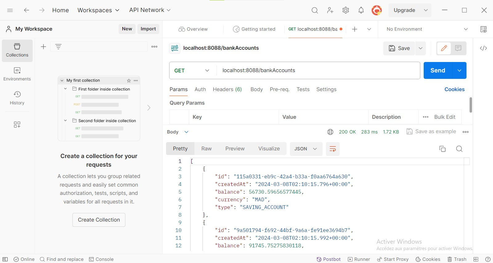
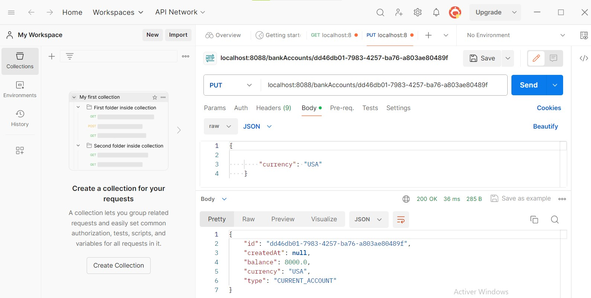
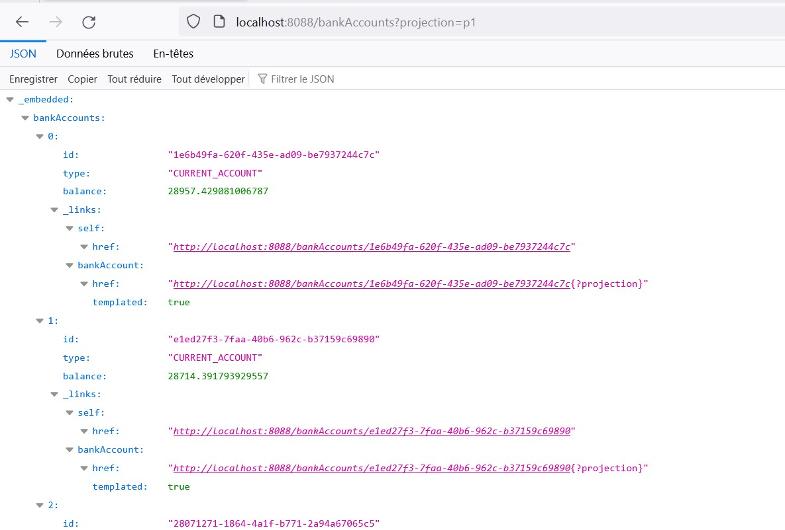

<h3>ACTIVITÉ PRATIQUE N2 : Développement d'un micro service</h3> 
<h4>Créer un micro service qui permet des gérer des comptes bancaires.</h4> 

<h3>QUESTION 1</h3>

Créer un projet Spring Boot avec les dépendances Web, Spring Data JPA, H2, Lombok

  

<h3>QUESTION 2</h3>

Créer l'entité JPA Compte

  

<h3>QUESTION 3</h3>

Créer l'interface CompteRepository basée sur Spring Data

  

<h3>QUESTION 4</h3>

Tester la couche DAO

<ul><li>Execution :</li>
<li> Base de données : BankAccount </li>
</ul> 

<h3>QUESTION 5</h3>

Créer le Web service Restfull qui permet de gérer des comptes

  

<h3>QUESTION 6</h3>

Tester le web micro-service en utilisant un client REST : Postman

<ul>
<li>Methode Get : Récupération de la liste des comptes.
</li>
<li>Methode Post : Ajout d'un nouveau comptes.
</li>
<li>Methode Put : Modification d'un compte grace a son identifiant.
</li>
</ul> 

<h3>QUESTION 7</h3>

Générer et tester la documentation Swagger des API Rest du Web service

<ul>
<li>Accueil de la documentation : </li>
<li>Affichage de la documentation de l'api rest : </li>
<li>Affichage de la liste des comptes : </li>
<li>Affichage du compte en fonction de l'id : </li>
<li>Ajout d'un compte via la documentation swagger : </li>
</ul> 

<h3>QUESTION 8</h3>

Exposer une API Restful en utilisant Spring Data Rest en exploitant des projections

<ul><li>Service restfull 1 : Spring data rest : </li>
<li>Service restfull 2 : Data rest controller : </li>
<li>Service restfull 1 : Pagination : </li>
<li>Service restfull 1 : Rechercher par type:CURRENT_ACCOUNT </li>
<li>Service restfull 1 : Rechercher par type:SAVING_ACCOUNT </li>
<li>Service restfull 1 : Affichage par projection  </li></ul> 

<h3>QUESTION 9</h3>

Créer les DTOs et Mappers

Test d'ajout d'un compte :
  

<h3>QUESTION 10</h3>

Créer la couche Service (métier) et du micro service

<h3>QUESTION 11</h3>

Créer un Web service GraphQL pour ce Micro-service

<ul>
<li> Consulyer la liste des comptes avec graphQL  </li> 
<li>Récupérer les informations d'un compte grace a l'identifiant </li> 
<li>Personnaliser le message d'erreur lorsqu'un compte n'exsite pas </li> 
<li>Ajouter un nouveau compte via de variables prédéfinies </li> 
<li>Modifier les informations d'un compte grace a l'identifiant </li> 
<li>Supprimer un compte grace a l'identifiant </li> 
<li>Consulter la liste des comptes avec leurs clients correspondants </li> 
<li>Consulter la liste des clients et leurs comptes respectifs (id , nom, comptes) </li> 
</ul>

<h3>FIN</h3>

